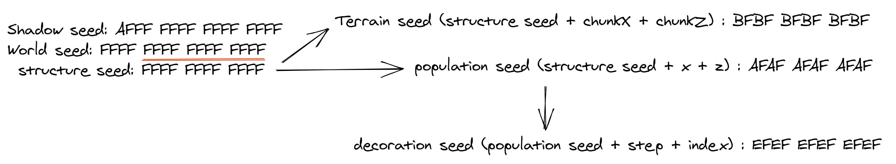

= Basic Terminology used in Seed related discussion

_Warning: This list is no where close to being done or claims to be 100% accurate on definitions.
The definitions used are based on what i can find in the discords or over the web; appropriate credit has been supplied wherever applicable.If you find any mistakes
please kindly let me know in the `discussions` or `issues` pane. Some of the definitions are laughable but they pass the context clearly, I will change them to proper definitions on further iterations_

* **World Seed** A world seed is a 64 bit seed, it is the only thing that determine a world (except the time of creation for some events in the world not related to world gen)
* **Shadow Seed** A shadow seed is a 64 bit seed which have the same biomes as the world seed but not the same terrain nor the same structures
* **Structure Seed** A structure seed is the 48 lower bits of the world seed, it is salted and seeded with the chunkX and chunkZ to find structure positions
* **Population Seed** A population seed is determined from the coordinate and the structure seed and is used for all the different element that need to be created on the terrrain
* **Terrain Seed** A terrain seed is determined from the structure seed, the chunkX and chunkZ coordinates and is used to make the chunk heights values
* **Decoration Seed** A decoration seed is for each element in the population stage and is fully determined with a step index (depending of the importance of the decorator) and a index in that step, it ofc use the population seed
* **Slime Seed** A slime seed is a seed used to determine slime chunk and is done thanks to the structure seed, chunkX and chunkZ, it is one of the only one which is not a linear equation (it is a second order polynomial)

_The above definitions were supplied by Neil#4879 on Minecraft@Home discord_

.Image Title (Seedtypes)

* **Offsets** - How much X is away from Y where X, Y are two numbers , in context of LCG's -> it is the addend part (multiplier * seed + addend)
* **Salts** - https://en.wikipedia.org/wiki/Salt_(cryptography)[Wiki] makes it pretty clear. https://minecraft.gamepedia.com/Custom_world_generation[Check the strucutres to know where the salt context lies]
* **Attack** - Think of cracking a seed . That "cracking" part is essentially the attack (on the proper LCG/generator algorithm) . In a proper way - it is the means of exploiting the weakness in a generator sequence or an algorithm.
